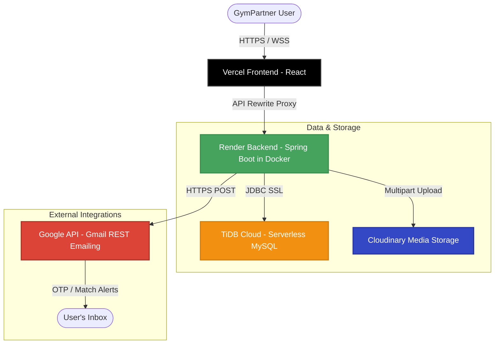

# 🏋️‍♂️ GymPartner

**Find your perfect workout partner, schedule sessions, and crush your fitness goals together.**

GymPartner is a state-of-the-art, full-stack fitness networking application that matches gym-goers based on their workouts, schedules, experience levels, and preferred locations. 

[](https://gym-partner-five.vercel.app/)
[](https://gympartner-backend.onrender.com)
[](https://tidbcloud.com)

---

## 🗺️ System Architecture

GymPartner is designed with a decoupled frontend-backend architecture built for high performance, ease of deployment, and modern web standards.



---

## ✨ Key Features

### 🤝 Smart Matchmaking System
* **Dynamic Matching Workflow:** Complete lifecycle management for matching requests (`PENDING`, `ACCEPTED`, `REJECTED`, `CANCELLED`, `TERMINATED`, `EXPIRED`).
* **Daily Limits:** Enforces a daily limit on outbound match requests to prevent spam and encourage high-quality interactions.
* **Safety Protocols:** Complete blocking mechanism that immediately prevents matches, messages, and suggestions between blocked users.

### 🏆 Gamified Reliability Scoring
* **Accountability Tracker:** Every user has a starting score of 100. The engine dynamically rewards or penalizes behaviors:
  * **+5 Points** for completing a scheduled session.
  * **+10 Points** for maintaining a weekly session streak.
  * **-10 Points** for canceling a session last minute.
  * **-15 Points** for a "No-Show" confirmation.
  * **-20 Points** for receiving user reports.

### 💬 Real-Time Chat & Group Messaging
* **WebSockets & STOMP:** Fully real-time private messages and group chat rooms with instant WebSocket delivery.
* **Unread Indicators:** Real-time badge counts and last-message previews.

### ☁️ Cloud Storage & Optimizations
* **Cloudinary Asset Storage:** Seamless profile picture upload using Cloudinary's secure REST upload API, generating optimized image URLs dynamically.
* **Smart Fallbacks:** Dynamically switches between local directory storage (for development) and Cloudinary (for production) based on environment flags.

### ✉️ Gmail API OTP Delivery
* **Firewall Bypassing:** Bypasses Render's strict email port block (SMTP 465/587) by using Google's secure OAuth2 HTTPS endpoint to send OTP codes and match alerts.

---

## 🛠️ Technology Stack

### Backend
* **Java 21** & **Spring Boot 3.x**
* **Spring Security** (Stateless JWT auth)
* **Spring Data JPA** (Hibernate)
* **Spring WebSocket** (STOMP messaging)
* **MySQL Connector** (with TiDB Cloud support)

### Frontend
* **React 19** & **TypeScript**
* **Tailwind CSS v4** (Modern CSS utility system)
* **TanStack Query** (Caching & state management)
* **TanStack Router** (Type-safe routing)
* **Framer Motion** (Smooth hardware-accelerated animations)
* **Radix UI** (Accessible primitives)

---

## ⚙️ Environment Variables

### Backend Configuration

Provide these environment variables in your local `.env` or cloud provider (Render):

| Variable Name | Description | Example / Default |
|---|---|---|
| `PORT` | The port your Spring Boot app binds to | `8080` (automatically set by Render) |
| `DB_URL` | TiDB / MySQL JDBC connection string | `jdbc:mysql://host:4000/db?sslMode=VERIFY_IDENTITY` |
| `DB_USERNAME` | Database username | `3PRAJah8MAWdn6B.root` |
| `DB_PASSWORD` | Database password | `fMIkDK8PNaiu8fB5` |
| `JWT_SECRET` | Secure signing key for JWT auth tokens | *Generated secure string* |
| `CLOUDINARY_URL` | Cloudinary integration string | `cloudinary://<api_key>:<secret>@<cloud_name>` |
| `GOOGLE_CLIENT_ID` | Google Console OAuth Client ID | `9046625...apps.googleusercontent.com` |
| `GOOGLE_CLIENT_SECRET`| Google Console OAuth Client Secret | `GOCSPX-xxxxx...` |
| `GOOGLE_REFRESH_TOKEN`| OAuth Playground generated Refresh Token | `1//04xxxxx...` |
| `CORS_ALLOWED_ORIGINS`| List of authorized CORS origins | `https://gym-partner-five.vercel.app,http://localhost:5173` |

### Frontend Configuration

Create a `.env` file at the root of `frontend_gym/pair-your-pump/`:

```env
VITE_API_BASE_URL=https://gympartner-backend.onrender.com
```

---

## 🚀 Getting Started

### Prerequisites
* **Java 21 JDK**
* **Node.js 18+** & **npm** (or **bun**)
* **MySQL** (or a free **TiDB Serverless** instance)

### 1. Database Setup
Ensure your MySQL or TiDB Database is running. Create a schema named `test` (or your preferred name):
```sql
CREATE DATABASE test;
```

### 2. Run Backend Locally
Update `src/main/resources/application.properties` with your database credentials, or set them as system environment variables.
```bash
# Build the application
./mvnw clean compile

# Run the Spring Boot application
./mvnw spring-boot:run
```
The REST API will start on `http://localhost:8080`.

### 3. Run Frontend Locally
Navigate to the React directory:
```bash
cd frontend_gym/pair-your-pump
npm install
npm run dev
```
Open `http://localhost:5173` in your browser.

---

## 📦 Dockerization

We use a Docker multi-stage build to compile and package the Spring Boot JAR inside a minimal JRE container.

### Build and Run Docker Image:
```bash
# Build the image
docker build -t gympartner-backend .

# Run the container
docker run -p 8080:8080 \
  -e DB_URL=jdbc:mysql://YOUR_DB_HOST:3306/test \
  -e DB_USERNAME=root \
  -e DB_PASSWORD=secret \
  gympartner-backend
```

---

## 🤝 Contributing

1. Fork the project.
2. Create your Feature Branch (`git checkout -b feature/AmazingFeature`).
3. Commit your changes (`git commit -m 'Add some AmazingFeature'`).
4. Push to the Branch (`git push origin feature/AmazingFeature`).
5. Open a Pull Request.

## 📄 License

Distributed under the MIT License. See `LICENSE` for more information.
